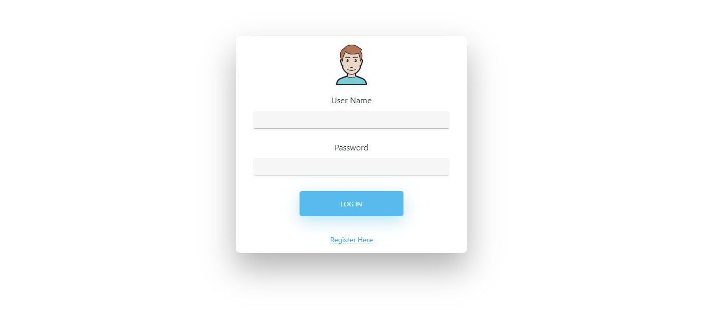
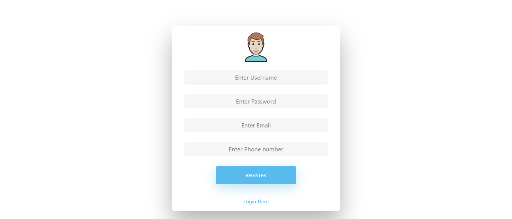
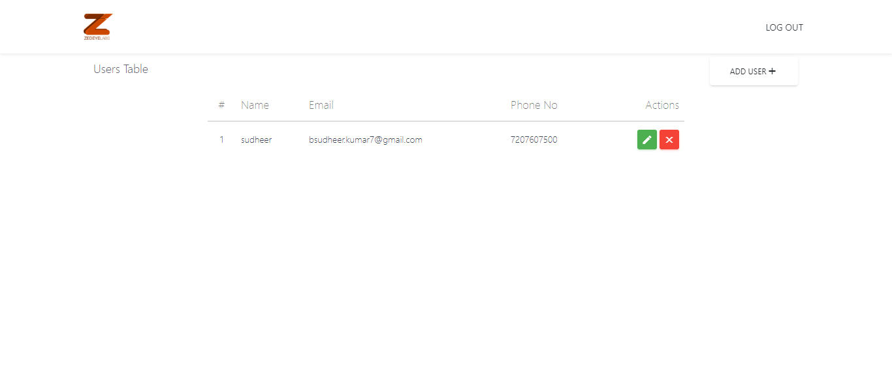
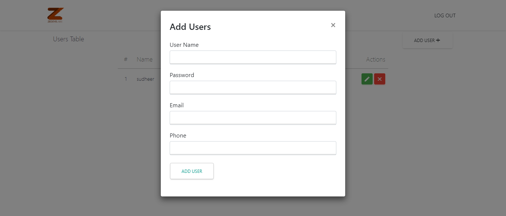
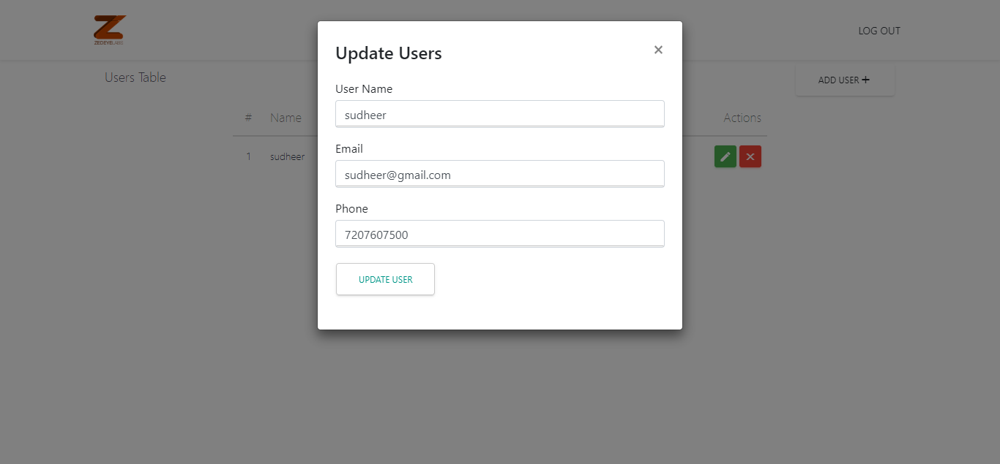
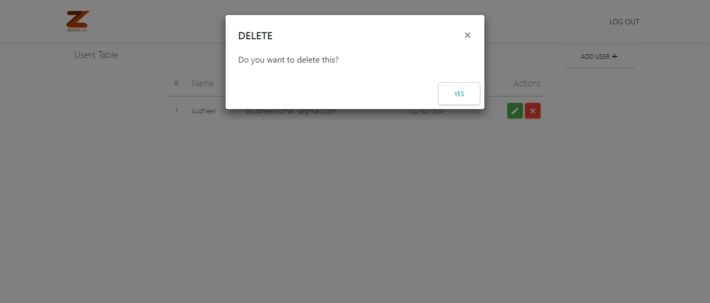
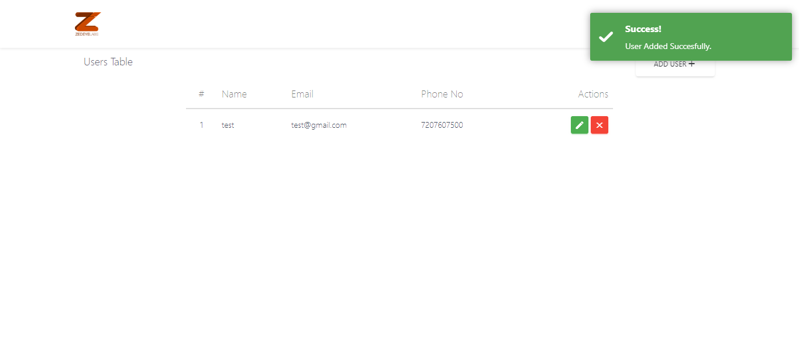
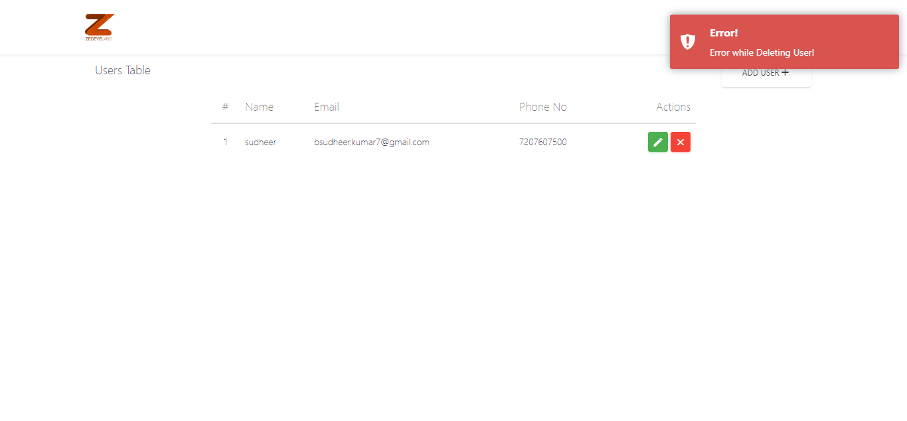

# zedEyeLabs-Assignment
### To run the project Install node modules in both frontend and backend
### 1. Login Page

### 2. Register Page

### 3. User  Page

### 4. Add User Pop-Up

### 5. Update User Pop-Up

### 6. Delete User Pop-Up

### 7. On Success toaster message 

### 8. On Failure toaster message 

